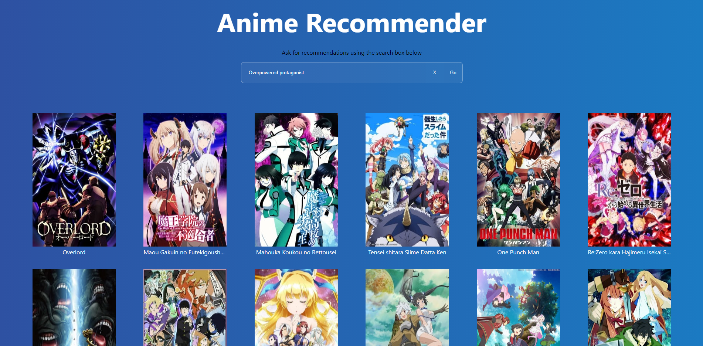
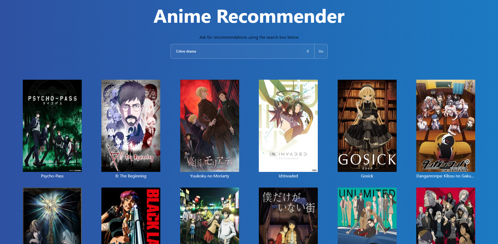
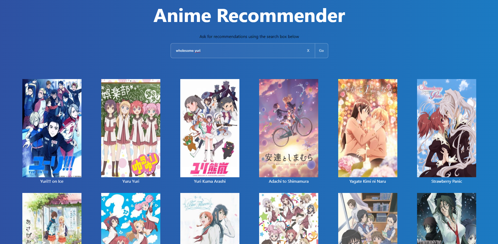
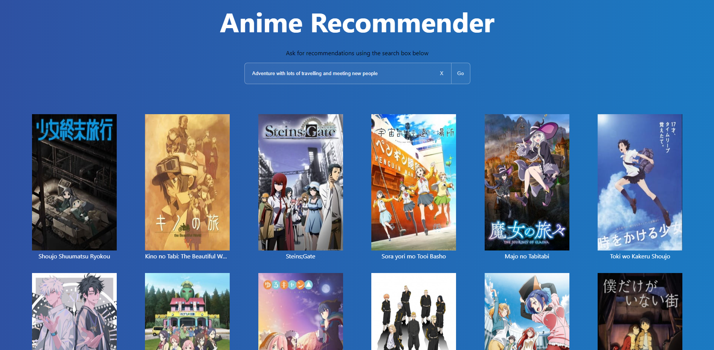

# Anime Recommender Backend

Backend for the AI Anime Recommender system. Frontend can be found [here](https://github.com/khave/AnimeRecommenderFrontend)
   
The recommender uses a Siamese Bert Network ([link](https://www.sbert.net/index.html)) to do asymmetric semantic search.  
The model is a fine-tuned distilbert-dot-tas_b-b256-msmarco ([link](https://huggingface.co/sebastian-hofstaetter/distilbert-dot-tas_b-b256-msmarco)) trained on 163,687 anime reviews (4000 anime in total) scraped from MyAnimeList ([link](https://myanimelist.net/)).  
Faiss ([link](https://github.com/facebookresearch/faiss)) is used to speed up the search process. This leads to speeds of around 200 milliseconds per request.  
The search process consists of getting the top N reviews closest to the query and then returning the anime with the most reviews returned.  
Training was done using [GPL](https://github.com/UKPLab/gpl). Code can be found in the train notebook. The model was trained for approximately 14 hours on A100.
 
The main.py can be run standalone for a console version.
 
Dataset can be found [here](https://www.kaggle.com/datasets/khaveofficial/animerecommender) 

## Examples
Query: Overpowered Protagonist

Query: Crime drama

Query: Wholesome yuri

Query: Adventure with lots of travelling and meeting new people

## Getting started
Clone the backend and [frontend](https://github.com/khave/AnimeRecommenderFrontend)  
Create a new folder called "data" inside the backend and put in the [dataset files](https://www.kaggle.com/datasets/khaveofficial/animerecommender)  
Run the backend with python api.py  
Run the frontend with npm start

## Future work
As this is a hobby project there are some big limitations with the current approach and many things could be done differently. 
Future work consists of
- Scrape more anime
- Use a different method for getting embeddings as the model stops after 512 tokens as a limitation of BERT models
    - Could for example split the reviews into multiple subtexts
- Look into other ways of getting information about anime such as reviews from other sites, interest stacks, forums posts etc.
- Create own labels for anime i.e. possible queries for anime (big manual task, which is why the GPL method was used)
- Possibly look into knowledge graphs and entity relationships as a different approach to the problem